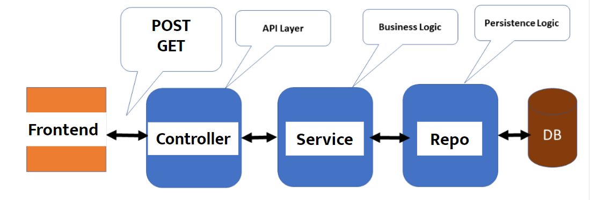
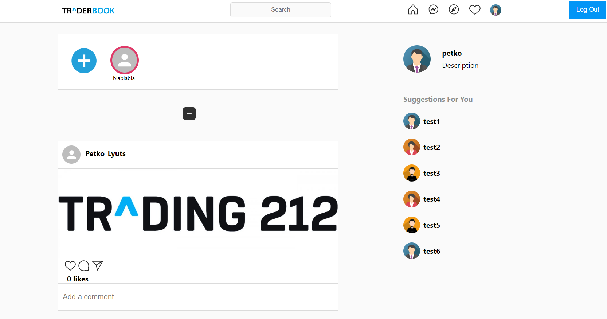

# Traderbook

Traderbook is a social web application for traders.

## Technical features
- REST API
- Тhird-party API integration for stock pricing
- Exception handling and error messaging
- Hibernate
- MySql
- MailGun
- Docker for testing
- Integration tests and JUnit tests
- React
- Firebase

## Back-End Architecture 
 

### Front-End

 
 

